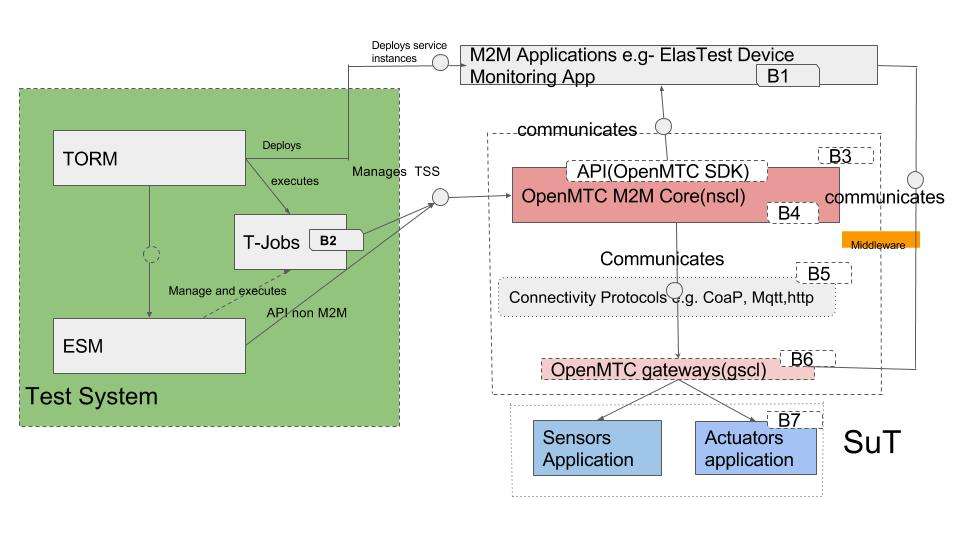

Architecture: Architecture of the component specifying the relation with other ElasTest components
Prepare development environment: How to prepare the development environment to develop this TSS. For example, what tools are required, in which version, etc.
Development procedure: All information useful to develop the component. For example, how to execute the component in the IDE, how to compile it, etc.
Docker images: Description of the docker images used for the component. If the components can be developed outside ElasTest and needs some docker containers to simulate the other ElasTest components, should be described here.
Continuous Integration: The description of the jobs used in ElasTest CI. What are used for, when are executed, etc. 

###Architecture:
 

The entire application EDS consists of many services such as- zigbeeipe, memsipe, rest_app, and frontend. We devide the architecture as follows:
 - sensor/actuator based services/application which uses m2m communication protocol.
 - Application to visualize all the data and metices coming from the sesor/actuator based services/application, which uses m2m communication protocol.
 - Simple restfull communication based service or application
 
###Prepare development environment:
 First make sure that EDS can work with ESM  and EMP.
 Install the following development tools:
 - [PyCharm IDE](https://www.jetbrains.com/pycharm/download/#section=linux)
 - [Python 2.7 and 3+](http://docs.python-guide.org/en/latest/starting/install3/linux/)
 -
 
 Last, Last, clone the repositories in a local folder:

```
git clone https://github.com/elastest/elastest-device-emulator-service
git clone https://github.com/elastest/elastest-service-manager.git
git clone https://github.com/elastest/elastest-monitoring-platform.git
```
 


 